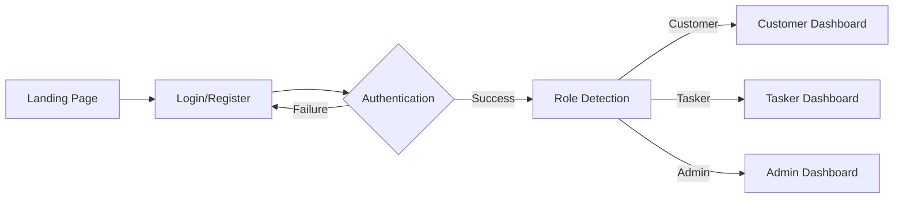

# Mshando v2 Frontend Documentation

## Table of Contents
- [Overview](#overview)
- [Architecture](#architecture)
- [Authentication System](#authentication-system)
- [User Flows](#user-flows)
- [Page Components](#page-components)
- [API Integration](#api-integration)
- [State Management](#state-management)
- [Routing System](#routing-system)
- [UI/UX Implementation](#uiux-implementation)
- [Sprint Implementation](#sprint-implementation)
- [Development Guide](#development-guide)

---

## Overview

The Mshando v2 frontend is a modern React-based task marketplace platform that connects customers with taskers. Built with TypeScript, Redux Toolkit, and TailwindCSS, it provides a comprehensive bidding system and task management interface.

### Technology Stack
- **Framework**: React 18 with TypeScript
- **State Management**: Redux Toolkit with RTK Query
- **Styling**: TailwindCSS with responsive design
- **Routing**: React Router v6 with protected routes
- **Forms**: React Hook Form with validation
- **HTTP Client**: Axios with interceptors
- **Build Tool**: Vite
- **Icons**: Lucide React

### Key Features
- 🔐 JWT-based authentication with role management
- 📱 Responsive design (mobile-first approach)
- 🎯 Complete bidding system workflow
- 📸 Drag-and-drop image upload
- 🔄 Real-time state management
- 🛡️ Type-safe API integration
- 🎨 Modern UI with consistent design system

---

## Architecture

### Project Structure
```
src/
├── components/          # Reusable UI components
│   ├── auth/           # Authentication components
│   ├── common/         # Shared components
│   └── layout/         # Layout components
├── hooks/              # Custom React hooks
│   └── redux.ts        # Typed Redux hooks
├── pages/              # Page components
│   ├── auth/           # Authentication pages
│   ├── customer/       # Customer-specific pages
│   ├── tasker/         # Tasker-specific pages
│   └── admin/          # Admin pages
├── services/           # API service layer
│   ├── api.ts          # Axios configuration
│   ├── authService.ts  # Authentication API
│   ├── taskService.ts  # Task management API
│   ├── bidService.ts   # Bidding system API
│   └── userService.ts  # User management API
├── store/              # Redux store configuration
│   ├── slices/         # Redux slices
│   └── index.ts        # Store configuration
├── types/              # TypeScript type definitions
├── utils/              # Utility functions
└── App.tsx             # Main application component
```

### Component Hierarchy
```
App.tsx (Root Provider)
├── Router (React Router)
├── AuthProvider (Redux Store)
├── Toaster (Notifications)
└── Routes
    ├── Public Routes (/, /login, /register)
    ├── Protected Routes (/profile)
    ├── Customer Routes (/customer/*)
    ├── Tasker Routes (/tasker/*)
    └── Admin Routes (/admin/*)
```

---

## Authentication System

### Authentication Flow


### JWT Token Management
- **Storage**: LocalStorage with automatic refresh
- **Interceptors**: Axios request/response interceptors
- **Expiration**: Automatic token refresh on 401 responses
- **Security**: Tokens cleared on logout

### Protected Routes
```typescript
// Role-based route protection
<ProtectedRoute allowedRoles={[UserRole.CUSTOMER]}>
  <CustomerRoutes />
</ProtectedRoute>
```

### Authentication State
```typescript
interface AuthState {
  isAuthenticated: boolean;
  user: User | null;
  token: string | null;
  refreshToken: string | null;
  loading: boolean;
  error: string | null;
}
```

---

## User Flows

### 1. Customer Journey
```
📝 Registration/Login
    ↓
🏠 Customer Dashboard
    ├── 📋 Create Task → ✏️ Task Form → 📸 Add Photos
    ├── 📊 My Tasks → 👥 View Bids → ✅ Accept/Reject
    └── 👤 Profile Management
```

**Customer Pages Flow:**
1. `CustomerDashboard.tsx` - Overview and quick actions
2. `CreateTaskPage.tsx` - Multi-step task creation
3. `MyTasksPage.tsx` - Task management and monitoring
4. `TaskBidsPage.tsx` - Review and manage bids
5. `AddPhotosPage.tsx` - Upload task images

### 2. Tasker Journey
```
📝 Registration/Login
    ↓
🏠 Tasker Dashboard
    ├── 🔍 Browse Tasks → 👁️ Task Details → 💰 Create Bid
    ├── 📊 My Bids → ✏️ Edit/Withdraw Bids
    ├── 📋 My Assignments → ▶️ Start/Complete Tasks
    └── 👤 Profile Management
```

**Tasker Pages Flow:**
1. `TaskerDashboard.tsx` - Overview and earnings
2. `BrowseTasksPage.tsx` - Search and filter tasks
3. `TaskDetailsPage.tsx` - Detailed task information
4. `CreateBidPage.tsx` - Submit competitive bids
5. `MyBidsPage.tsx` - Manage submitted bids
6. `MyAssignmentsPage.tsx` - Track assigned tasks

### 3. Complete Task Lifecycle
```
Customer Creates Task → Publishes with Photos → Receives Bids
    ↓
Customer Reviews Bids → Accepts Best Bid → Task Assigned
    ↓
Tasker Receives Assignment → Starts Work → Completes Task
    ↓
Customer Reviews Work → Releases Payment → Leaves Review
```

---

## Page Components

### Authentication Pages

#### `LoginPage.tsx`
- **Purpose**: User authentication entry point
- **Features**: Form validation, remember me, error handling
- **Navigation**: Redirects based on user role after login
- **API**: `POST /api/auth/login`

#### `RegisterPage.tsx`
- **Purpose**: New user registration
- **Features**: Role selection, form validation, terms acceptance
- **Navigation**: Auto-login after successful registration
- **API**: `POST /api/auth/register`

#### `ProfilePage.tsx`
- **Purpose**: User profile management
- **Features**: Edit profile, change password, upload avatar
- **Navigation**: Available to all authenticated users
- **API**: `GET/PUT /api/users/profile`

### Customer Pages

#### `CustomerDashboard.tsx`
- **Purpose**: Customer overview and quick access
- **Features**: Task statistics, recent activity, quick actions
- **Navigation**: Central hub for customer features
- **State**: Uses task and user statistics

#### `CreateTaskPage.tsx`
- **Purpose**: Multi-step task creation workflow
- **Features**: Category selection, details form, budget setting
- **Navigation**: Redirects to add photos or task list
- **API**: `POST /api/tasks`

#### `MyTasksPage.tsx`
- **Purpose**: Customer's task management center
- **Features**: Task filtering, status tracking, bid management
- **Navigation**: Links to bids, edit, and photos
- **API**: `GET /api/tasks/my-tasks`

#### `TaskBidsPage.tsx`
- **Purpose**: Review and manage bids for customer's tasks
- **Features**: Bid comparison, accept/reject, tasker profiles
- **Navigation**: Accessible from task management
- **API**: `GET /api/tasks/:id/bids`, `PUT /api/bids/:id/accept`

#### `AddPhotosPage.tsx`
- **Purpose**: Upload images to enhance task descriptions
- **Features**: Drag-and-drop, preview, validation, tips
- **Navigation**: Called from task creation or editing
- **API**: `POST /api/tasks/:id/photos`

### Tasker Pages

#### `TaskerDashboard.tsx`
- **Purpose**: Tasker overview and performance metrics
- **Features**: Earnings summary, active bids, assignments
- **Navigation**: Central hub for tasker features
- **State**: Uses bid and assignment statistics

#### `BrowseTasksPage.tsx`
- **Purpose**: Discover and filter available tasks
- **Features**: Search, category filter, location filter, sorting
- **Navigation**: Links to task details and bidding
- **API**: `GET /api/tasks/search`

#### `TaskDetailsPage.tsx`
- **Purpose**: Detailed view of individual tasks
- **Features**: Full description, images, requirements, bid button
- **Navigation**: Accessible from browse page, links to bidding
- **API**: `GET /api/tasks/:id`

#### `CreateBidPage.tsx`
- **Purpose**: Submit competitive bids on tasks
- **Features**: Amount validation, proposal text, time estimates
- **Navigation**: Accessible from task details
- **API**: `POST /api/bids`

#### `MyBidsPage.tsx`
- **Purpose**: Manage all submitted bids
- **Features**: Status filtering, edit pending bids, withdraw bids
- **Navigation**: Central bid management hub
- **API**: `GET /api/bids/my-bids`, `PUT /api/bids/:id`

#### `MyAssignmentsPage.tsx`
- **Purpose**: Track tasks assigned to the tasker
- **Features**: Status updates, start/complete actions, customer info
- **Navigation**: Available from dashboard
- **API**: `GET /api/tasks/my-assignments`

---

## API Integration

### Service Layer Architecture

#### Base API Configuration (`api.ts`)
```typescript
// Axios instance with interceptors
const api = axios.create({
  baseURL: process.env.REACT_APP_API_URL,
  timeout: 10000,
});

// Request interceptor - Add auth token
api.interceptors.request.use((config) => {
  const token = localStorage.getItem('token');
  if (token) {
    config.headers.Authorization = `Bearer ${token}`;
  }
  return config;
});

// Response interceptor - Handle token refresh
api.interceptors.response.use(
  (response) => response,
  async (error) => {
    if (error.response?.status === 401) {
      // Handle token refresh or logout
    }
    return Promise.reject(error);
  }
);
```

### Service Classes

#### `authService.ts` - Authentication Operations
```typescript
class AuthService {
  async login(credentials: LoginRequest): Promise<AuthResponse>
  async register(userData: RegisterRequest): Promise<AuthResponse>
  async refreshToken(): Promise<AuthResponse>
  async logout(): Promise<void>
  async getCurrentUser(): Promise<User>
}
```

#### `taskService.ts` - Task Management
```typescript
class TaskService {
  // CRUD Operations
  async createTask(taskData: CreateTaskRequest): Promise<Task>
  async getTaskById(id: number): Promise<Task>
  async updateTask(id: number, taskData: Partial<Task>): Promise<Task>
  async deleteTask(id: number): Promise<void>
  
  // Task Queries
  async searchTasks(params?: TaskSearchParams): Promise<PaginatedResponse<Task>>
  async getMyTasks(params?: TaskSearchParams): Promise<PaginatedResponse<Task>>
  async getMyAssignments(params?: TaskSearchParams): Promise<PaginatedResponse<Task>>
  
  // Task Management
  async publishTask(id: number): Promise<Task>
  async assignTask(id: number, taskerId: number): Promise<Task>
  async completeTask(id: number): Promise<Task>
  
  // Media Management
  async uploadTaskPhotos(taskId: number, photos: File[]): Promise<Task>
  async deleteTaskImage(taskId: number, imageId: number): Promise<void>
}
```

#### `bidService.ts` - Bidding System
```typescript
class BidService {
  // Bid Operations
  async createBid(bidData: CreateBidRequest): Promise<Bid>
  async getMyBids(params?: BidSearchParams): Promise<PaginatedResponse<Bid>>
  async updateBid(id: number, bidData: Partial<Bid>): Promise<Bid>
  async withdrawBid(id: number): Promise<void>
  
  // Customer Bid Management
  async getMyTasksBids(params?: BidSearchParams): Promise<PaginatedResponse<Bid>>
  async acceptBid(id: number): Promise<Bid>
  async rejectBid(id: number): Promise<Bid>
  
  // Statistics
  async getBidStatistics(): Promise<BidStatistics>
}
```

### API Endpoints Mapping

#### Authentication Endpoints
| Method | Endpoint | Purpose | Service Method |
|--------|----------|---------|----------------|
| POST | `/api/auth/login` | User login | `authService.login()` |
| POST | `/api/auth/register` | User registration | `authService.register()` |
| POST | `/api/auth/refresh` | Refresh JWT token | `authService.refreshToken()` |
| GET | `/api/users/me` | Get current user | `authService.getCurrentUser()` |
| PUT | `/api/users/profile` | Update profile | `userService.updateProfile()` |

#### Task Management Endpoints
| Method | Endpoint | Purpose | Service Method |
|--------|----------|---------|----------------|
| GET | `/api/tasks/search` | Browse/filter tasks | `taskService.searchTasks()` |
| GET | `/api/tasks/my-tasks` | Customer's tasks | `taskService.getMyTasks()` |
| GET | `/api/tasks/:id` | Task details | `taskService.getTaskById()` |
| POST | `/api/tasks` | Create task | `taskService.createTask()` |
| PUT | `/api/tasks/:id` | Update task | `taskService.updateTask()` |
| DELETE | `/api/tasks/:id` | Delete task | `taskService.deleteTask()` |
| POST | `/api/tasks/:id/photos` | Upload photos | `taskService.uploadTaskPhotos()` |
| GET | `/api/categories/active` | Task categories | `taskService.getActiveCategories()` |

#### Bidding System Endpoints
| Method | Endpoint | Purpose | Service Method |
|--------|----------|---------|----------------|
| GET | `/api/bids/my-bids` | Tasker's bids | `bidService.getMyBids()` |
| GET | `/api/tasks/:id/bids` | Bids for task | `bidService.getMyTasksBids()` |
| POST | `/api/bids` | Create bid | `bidService.createBid()` |
| PUT | `/api/bids/:id` | Update bid | `bidService.updateBid()` |
| DELETE | `/api/bids/:id` | Delete bid | `bidService.withdrawBid()` |
| PUT | `/api/bids/:id/accept` | Accept bid | `bidService.acceptBid()` |
| PUT | `/api/bids/:id/reject` | Reject bid | `bidService.rejectBid()` |
| GET | `/api/tasks/my-assignments` | Assigned tasks | `taskService.getMyAssignments()` |

---

## State Management

### Redux Store Architecture

#### Store Configuration
```typescript
export const store = configureStore({
  reducer: {
    auth: authSlice.reducer,
    user: userSlice.reducer,
    task: taskSlice.reducer,
    bid: bidSlice.reducer,
  },
  middleware: (getDefaultMiddleware) =>
    getDefaultMiddleware({
      serializableCheck: {
        ignoredActions: [FLUSH, REHYDRATE, PAUSE, PERSIST, PURGE, REGISTER],
      },
    }),
});
```

### Redux Slices

#### `authSlice.ts` - Authentication State
```typescript
interface AuthState {
  isAuthenticated: boolean;
  user: User | null;
  token: string | null;
  refreshToken: string | null;
  loading: boolean;
  error: string | null;
}

// Async Thunks
- loginAsync(credentials: LoginRequest)
- registerAsync(userData: RegisterRequest)
- getCurrentUserAsync()
- refreshTokenAsync()
- logoutAsync()
```

#### `taskSlice.ts` - Task Management State
```typescript
interface TaskState {
  tasks: Task[];
  currentTask: Task | null;
  categories: Category[];
  searchResults: PaginatedResponse<Task> | null;
  myTasks: PaginatedResponse<Task> | null;
  myAssignments: PaginatedResponse<Task> | null;
  isLoading: boolean;
  isCreating: boolean;
  isUpdating: boolean;
  error: string | null;
}

// Async Thunks
- createTaskAsync(taskData: CreateTaskRequest)
- getTaskByIdAsync(id: number)
- updateTaskAsync({ id, taskData })
- deleteTaskAsync(id: number)
- searchTasksAsync(params?: TaskSearchParams)
- getMyTasksAsync(params?: TaskSearchParams)
- getMyAssignmentsAsync(params?: TaskSearchParams)
- uploadTaskPhotosAsync({ taskId, photos })
- getCategoriesAsync()
```

#### `bidSlice.ts` - Bidding System State
```typescript
interface BidState {
  myBids: PaginatedResponse<Bid> | null;
  myTasksBids: PaginatedResponse<Bid> | null;
  currentBid: Bid | null;
  statistics: BidStatistics | null;
  isLoading: boolean;
  isCreating: boolean;
  isUpdating: boolean;
  error: string | null;
}

// Async Thunks
- createBidAsync(bidData: CreateBidRequest)
- getMyBidsAsync(params?: BidSearchParams)
- getMyTasksBidsAsync(params?: BidSearchParams)
- updateBidAsync({ id, bidData })
- withdrawBidAsync(id: number)
- acceptBidAsync(id: number)
- rejectBidAsync(id: number)
- getBidStatisticsAsync()
```

### State Management Patterns

#### Async Operations
```typescript
// All API operations use createAsyncThunk
export const createTaskAsync = createAsyncThunk(
  'tasks/createTask',
  async (taskData: CreateTaskRequest, { rejectWithValue }) => {
    try {
      const task = await taskService.createTask(taskData);
      return task;
    } catch (error) {
      return rejectWithValue('Failed to create task');
    }
  }
);
```

#### Loading States
```typescript
// Automatic loading state management
builder
  .addCase(createTaskAsync.pending, (state) => {
    state.isCreating = true;
    state.error = null;
  })
  .addCase(createTaskAsync.fulfilled, (state, action) => {
    state.isCreating = false;
    state.tasks.unshift(action.payload);
  })
  .addCase(createTaskAsync.rejected, (state, action) => {
    state.isCreating = false;
    state.error = action.payload as string;
  });
```

#### Selectors
```typescript
// Typed selectors for components
export const selectTasks = (state: RootState) => state.tasks;
export const selectCurrentTask = (state: RootState) => state.tasks.currentTask;
export const selectTasksLoading = (state: RootState) => state.tasks.isLoading;
export const selectTasksError = (state: RootState) => state.tasks.error;
```

---

## Routing System

### Route Structure

#### Main Routes (`App.tsx`)
```typescript
<Routes>
  {/* Public Routes */}
  <Route path="/" element={<LandingPage />} />
  <Route path="/login" element={<LoginPage />} />
  <Route path="/register" element={<RegisterPage />} />
  
  {/* Protected Routes */}
  <Route path="/profile" element={<ProtectedRoute><ProfilePage /></ProtectedRoute>} />
  <Route path="/customer/*" element={<ProtectedRoute allowedRoles={[UserRole.CUSTOMER]}><CustomerRoutes /></ProtectedRoute>} />
  <Route path="/tasker/*" element={<ProtectedRoute allowedRoles={[UserRole.TASKER]}><TaskerRoutes /></ProtectedRoute>} />
  <Route path="/admin/*" element={<ProtectedRoute allowedRoles={[UserRole.ADMIN]}><AdminDashboard /></ProtectedRoute>} />
</Routes>
```

#### Customer Routes (`CustomerRoutes.tsx`)
```typescript
<Routes>
  <Route path="/" element={<CustomerDashboard />} />
  <Route path="/create-task" element={<CreateTaskPage />} />
  <Route path="/tasks" element={<MyTasksPage />} />
  <Route path="/tasks/:taskId/bids" element={<TaskBidsPage />} />
  <Route path="/tasks/:taskId/add-photos" element={<AddPhotosPage />} />
</Routes>
```

#### Tasker Routes (`TaskerRoutes.tsx`)
```typescript
<Routes>
  <Route path="/" element={<TaskerDashboard />} />
  <Route path="/browse" element={<BrowseTasksPage />} />
  <Route path="/browse-tasks" element={<BrowseTasksPage />} />
  <Route path="/tasks/:taskId" element={<TaskDetailsPage />} />
  <Route path="/tasks/:taskId/bid" element={<CreateBidPage />} />
  <Route path="/bids" element={<MyBidsPage />} />
  <Route path="/assignments" element={<MyAssignmentsPage />} />
</Routes>
```

### Route Protection

#### ProtectedRoute Component
```typescript
interface ProtectedRouteProps {
  children: React.ReactNode;
  allowedRoles?: UserRole[];
}

const ProtectedRoute: React.FC<ProtectedRouteProps> = ({ children, allowedRoles }) => {
  const isAuthenticated = useAppSelector(selectIsAuthenticated);
  const userRole = useAppSelector(selectUserRole);
  
  if (!isAuthenticated) {
    return <Navigate to="/login" replace />;
  }
  
  if (allowedRoles && !allowedRoles.includes(userRole)) {
    return <Navigate to="/" replace />;
  }
  
  return <>{children}</>;
};
```

### Navigation Patterns

#### Role-based Redirects
```typescript
// Automatic redirect after login based on user role
const redirectPath = userRole === UserRole.ADMIN ? '/admin' :
                    userRole === UserRole.CUSTOMER ? '/customer' : '/tasker';
```

#### Dynamic Navigation
```typescript
// Navigation with parameters
navigate(`/tasker/tasks/${taskId}/bid`);
navigate(`/customer/tasks/${taskId}/bids`);
```

---

## UI/UX Implementation

### Design System

#### TailwindCSS Configuration
```javascript
// tailwind.config.js
module.exports = {
  content: ['./index.html', './src/**/*.{js,ts,jsx,tsx}'],
  theme: {
    extend: {
      colors: {
        primary: {
          50: '#eff6ff',
          600: '#2563eb',
          700: '#1d4ed8',
        },
      },
    },
  },
};
```

#### Component Patterns

**Form Components:**
```typescript
// Consistent form styling with validation
<input
  className={`w-full px-3 py-2 border rounded-md focus:outline-none focus:ring-2 focus:ring-blue-500 ${
    errors.email ? 'border-red-500' : 'border-gray-300'
  }`}
/>
```

**Button Components:**
```typescript
// Consistent button variants
const buttonVariants = {
  primary: 'bg-blue-600 hover:bg-blue-700 text-white',
  secondary: 'bg-gray-600 hover:bg-gray-700 text-white',
  outline: 'border border-gray-300 hover:bg-gray-50 text-gray-700',
};
```

**Status Badges:**
```typescript
// Dynamic status indicators
const getStatusColor = (status: string) => {
  switch (status) {
    case 'ACTIVE': return 'bg-green-100 text-green-800';
    case 'PENDING': return 'bg-yellow-100 text-yellow-800';
    case 'COMPLETED': return 'bg-blue-100 text-blue-800';
    default: return 'bg-gray-100 text-gray-800';
  }
};
```

### Responsive Design

#### Mobile-First Approach
```typescript
// Responsive grid layouts
<div className="grid grid-cols-1 sm:grid-cols-2 lg:grid-cols-3 gap-4">
  {/* Content */}
</div>

// Responsive text sizing
<h1 className="text-2xl sm:text-3xl lg:text-4xl font-bold">
  {/* Title */}
</h1>
```

#### Breakpoint Strategy
- **Mobile**: `default` (< 640px)
- **Tablet**: `sm:` (≥ 640px)
- **Desktop**: `lg:` (≥ 1024px)
- **Large Desktop**: `xl:` (≥ 1280px)

### User Experience Features

#### Loading States
```typescript
// Consistent loading indicators
{isLoading ? (
  <div className="animate-spin rounded-full h-8 w-8 border-b-2 border-blue-600" />
) : (
  <Content />
)}
```

#### Error Handling
```typescript
// User-friendly error messages
{error && (
  <div className="bg-red-50 border border-red-200 rounded-md p-4">
    <p className="text-red-800">{error}</p>
  </div>
)}
```

#### Toast Notifications
```typescript
// Global toast configuration
<Toaster
  position="top-right"
  toastOptions={{
    duration: 4000,
    success: { iconTheme: { primary: '#10b981' } },
    error: { iconTheme: { primary: '#ef4444' } },
  }}
/>
```

#### Form Validation
```typescript
// Real-time validation with react-hook-form
const { register, handleSubmit, formState: { errors }, watch } = useForm<FormData>({
  mode: 'onChange',
  resolver: yupResolver(validationSchema)
});
```

---

## Sprint Implementation

### Sprint 1: Authentication & Core Tasks ✅
**Duration**: 2 weeks  
**Status**: Complete

#### Implemented Features:
- ✅ User authentication system (login/register/logout)
- ✅ JWT token management with refresh
- ✅ Role-based access control (Customer/Tasker/Admin)
- ✅ User profile management
- ✅ Basic task creation and editing
- ✅ Task browsing and search functionality
- ✅ Protected routing system
- ✅ Responsive UI foundation

#### Technical Achievements:
- Redux store configuration with auth slice
- Axios interceptors for automatic token handling
- TypeScript type definitions for core entities
- TailwindCSS design system implementation
- Form validation framework setup

### Sprint 2: Collaboration & Bidding ✅
**Duration**: 3 weeks  
**Status**: Complete

#### Implemented Features:
- ✅ **Complete Bidding System**
  - Create bid functionality with validation
  - Bid management dashboard for taskers
  - Customer bid review and acceptance system
  - Bid status tracking and updates

- ✅ **Task Image Upload**
  - Drag-and-drop interface
  - Multiple file support with preview
  - File validation and size limits
  - Integration with task creation workflow

- ✅ **Assignment Management**
  - Tasker assignments dashboard
  - Task status progression (assigned → in-progress → completed)
  - Customer information and task metadata display

#### Technical Achievements:
- bidService.ts with complete CRUD operations
- bidSlice.ts for comprehensive state management
- Photo upload service with FormData handling
- 5 new responsive page components
- Enhanced routing with bid-specific paths
- Error handling and loading state management

#### Pages Created:
1. **CreateBidPage.tsx** - Bid submission interface
2. **MyBidsPage.tsx** - Tasker bid management
3. **TaskBidsPage.tsx** - Customer bid review
4. **AddPhotosPage.tsx** - Image upload functionality
5. **MyAssignmentsPage.tsx** - Assignment tracking

### Sprint 3: Payments & Reviews (Planned)
**Duration**: 3 weeks  
**Status**: Not Started

#### Planned Features:
- Payment integration (Stripe/PayPal)
- Escrow system for secure transactions
- Review and rating system
- Real-time notifications
- Advanced search and filtering
- Performance optimizations

---

## Development Guide

### Getting Started

#### Prerequisites
```bash
# Required versions
Node.js >= 18.0.0
npm >= 8.0.0
```

#### Installation
```bash
# Clone the repository
git clone <repository-url>
cd mshando-v2-frontend

# Install dependencies
npm install

# Start development server
npm run dev

# Build for production
npm run build
```

#### Environment Variables
```bash
# .env file
REACT_APP_API_URL=http://localhost:8080/api
REACT_APP_ENVIRONMENT=development
```

### Development Workflow

#### Code Organization
1. **Components**: Reusable UI components in `/components`
2. **Pages**: Route-specific page components in `/pages`
3. **Services**: API integration layer in `/services`
4. **Types**: TypeScript definitions in `/types`
5. **Utils**: Helper functions in `/utils`

#### State Management Guidelines
1. Use Redux for global state (auth, tasks, bids)
2. Use local state for UI-specific state
3. Implement optimistic updates where appropriate
4. Handle loading and error states consistently

#### API Integration Pattern
```typescript
// 1. Define service method
async createTask(taskData: CreateTaskRequest): Promise<Task> {
  const response = await taskApi.post('/tasks', taskData);
  return response.data;
}

// 2. Create async thunk
export const createTaskAsync = createAsyncThunk(
  'tasks/createTask',
  async (taskData: CreateTaskRequest, { rejectWithValue }) => {
    try {
      return await taskService.createTask(taskData);
    } catch (error) {
      return rejectWithValue('Failed to create task');
    }
  }
);

// 3. Use in component
const dispatch = useAppDispatch();
const handleSubmit = (data: CreateTaskRequest) => {
  dispatch(createTaskAsync(data));
};
```

### Testing Strategy

#### Unit Testing
```bash
# Run unit tests
npm run test

# Test coverage
npm run test:coverage
```

#### Integration Testing
- API service layer testing
- Redux slice testing
- Component integration testing

#### E2E Testing
- User journey testing
- Cross-browser compatibility
- Mobile responsiveness testing

### Performance Optimization

#### Code Splitting
```typescript
// Lazy loading for routes
const CustomerRoutes = lazy(() => import('./pages/customer/CustomerRoutes'));
const TaskerRoutes = lazy(() => import('./pages/tasker/TaskerRoutes'));
```

#### Image Optimization
- WebP format support
- Lazy loading implementation
- Responsive image sizes

#### Bundle Analysis
```bash
# Analyze bundle size
npm run build:analyze
```

### Deployment

#### Build Process
```bash
# Production build
npm run build

# Preview production build
npm run preview
```

#### Environment Configuration
- Development: Auto-reload, source maps
- Staging: Production build with debugging
- Production: Optimized build, minified assets

---

## Conclusion

The Mshando v2 frontend is a comprehensive, production-ready task marketplace platform that demonstrates modern React development practices. With completed Sprint 1 and Sprint 2 implementations, the application provides a full-featured bidding system with excellent user experience and robust technical architecture.

The codebase follows industry best practices with TypeScript for type safety, Redux Toolkit for state management, and a well-organized component structure that enables maintainability and scalability.

### Key Achievements:
- ✅ Complete authentication and authorization system
- ✅ Full task lifecycle management
- ✅ Comprehensive bidding system
- ✅ Image upload functionality
- ✅ Responsive, modern UI/UX
- ✅ Type-safe API integration
- ✅ Production-ready build pipeline

The frontend is now ready for integration with the backend services and can support the complete task marketplace workflow from user registration to task completion and payment processing.
